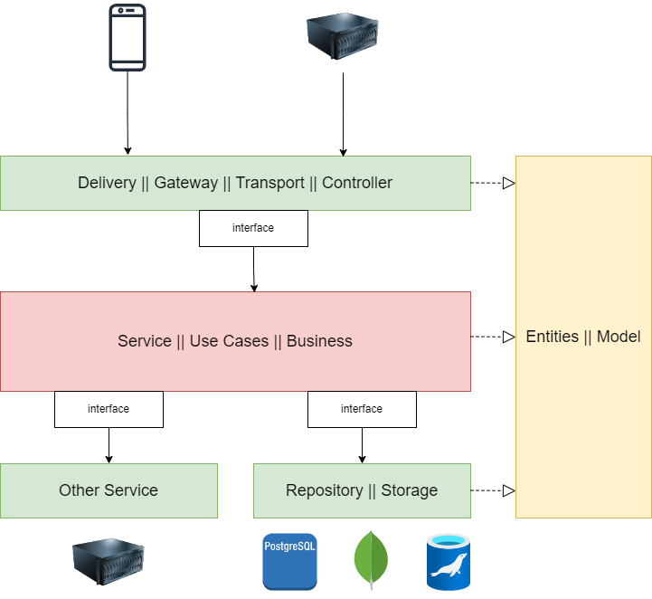
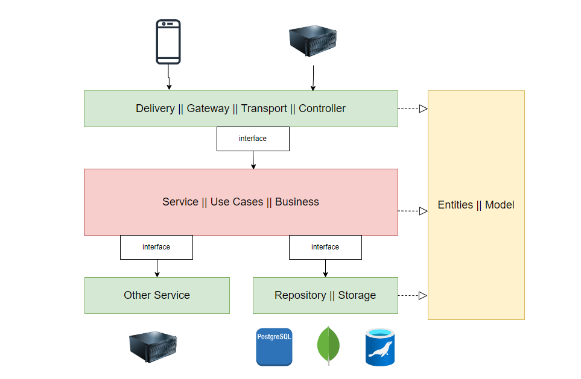

# Go Clean Architecture Template

Lorem ipsum dolor sit amet, consectetur adipiscing elit, sed do eiusmod tempor incididunt ut labore et dolore magna aliqua. Ut enim ad minim veniam, quis nostrud exercitation ullamco laboris nisi ut aliquip ex ea commodo consequat. Duis aute irure dolor in reprehenderit in voluptate velit esse cillum dolore eu fugiat nulla pariatur.

## Contents
- [Clean Architecture](#clean-architecture)
- [Project Structure](#project-structure)
- [SDK](#sdk)
  - [x] Mysql
  - [x] Logger
  - [x] Rest Api
  - [x] GRPC
  - [ ] Redis
  - [ ] Mongo
  - [ ] Service management

  
## Clean Architecture
***Clean Architecture*** là một kiến trúc ứng dụng rất nổi tiếng dựa trên nguyên lý loại bỏ sự lệ thuộc giữa các đối tượng
cũng như các layer trong ứng dụng. Nguyên lý này kế thừa và phát triển dựa trên **Dependency Inversion** - nguyên lý nổi
tiếng trong SOLID.

Trong kiến trúc Clean Architecture bao gồm 4 layer được đại diện thông qua các vòng tròn đồng tâm. Các vòng tròn ở trong 
sẽ không hề biết gì về các vòng tròn bên ngoài. Nguyên tắc "hướng tâm" này được minh hoạ như sau:

### Entities
***Entities*** là layer trong cùng, cũng là layer quan trọng nhất. Entity chính là các thực thể hay từng đối tượng cụ thể và 
các rule business logic của nó. Trong **OOP**, đây chính là **Object** cùng với các **method** và **properties** tuân thủ nguyên tắc 
**Encapsulation** - chỉ bên trong Object mới có thể thay đổi trạng thái (**State**) của chính nó.

VD: Trong object **Person** thì thuộc tính **age** không thể bé hơn 1. Nếu cần thay đổi age, chúng ta phải viết hàm **public setAge**, 
hàm này cũng chịu trách nhiệm check điều kiện liên quan tới **age**.

Các business logic của layer Entities sẽ không quan tâm hay lệ thuộc vào các business logic ở các layer bên ngoài như Use Cases. 
Giả sử với trường hợp người dùng phải từ 18 tuổi trở lên mới được phép tạo tài khoản thì rule thuộc tính Age trong Entities vẫn không đổi.

### Use Cases
***Use Cases*** là layer chứa các business logic ở cấp độ cụ thể từng Use Case (hay application).

VD: Use Case đăng ký tài khoản (tạo mới một Person/Account) sẽ cần tổ hợp một hoặc nhiều Entities tuỳ vào độ phức tạp của Use Case.

Các business logic của Use Case đương nhiên cũng sẽ không quan tâm và lệ thuộc vào việc dữ liệu đến từ đâu, dùng các thư 
viện nào làm apdapter, dữ liệu thể hiện thế nào,... Vì đấy là nhiệm vụ của layer **Interface Adapters**.

### Interface Adapters
***Interface Adapters*** chính là layer phụ trách việc chuyển đổi các format dữ liệu để phù hợp với từng Use Case và Entities. 
Các format dữ liệu này có thể dùng cho cả bên trong hoặc ngoài ứng dụng.

VD: Thông tin người dùng sẽ có một số thông tin rất nhạy cảm như **Email**, **Phone**, **Address**. Không phải lúc nào dữ liệu cũng 
về đầy đủ để phục vụ (Web, App). Tương tự với tuỳ vào hệ thống Database mà các adapter phải format dữ liệu hợp lý.

Như vậy dữ liệu đầu vào và ra ở tầng **Interface Apdapter** chỉ cần đủ và hợp lý. Nó sẽ không quan tâm việc dữ liệu sẽ được hiển 
thị cụ thể như thế nào cũng như được thu thập như thế nào. Vì đó là nhiệm vụ của tầng **Frameworks & Drivers**.

### Frameworks & Drivers
***Frameworkd & Drivers*** là tầng ngoài cùng, tổ hợp các công cụ cụ thể phục vụ cho từng nhu cầu của end user như: thiết bị 
(devices), web, application, databases,... Trong kiến trúc Clean Architecture thì ở tầng này là "nhẹ" nhất vì chúng ta 
không cần phải viết quá nhiều code.

Trên thực tế thì đây là nơi "biết tất cả" cụ thể các tầng là gì thông qua việc chịu trách nhiệm khởi tạo các objects 
cho các tầng bên trong (hay còn gọi là **Setup Dependencies**)

> Để các layer trong **Clean Architecture** có thể làm việc được nhưng lại độc lập với nhau thì chúng sẽ dùng các **Interfaces**.

Where can I get some?
There are many variations of passages of Lorem Ipsum available, but the majority have suffered alteration in some form, by injected humour, or randomised words which don't look even slightly believable. If you are going to use a passage of Lorem Ipsum, you need to be sure there isn't anything embarrassing hidden in the middle of text. All the Lorem Ipsum generators on the Internet tend to repeat predefined chunks as necessary, making this the first true generator on the Internet. It uses a dictionary of over 200 Latin words, combined with a handful of model sentence structures, to generate Lorem Ipsum which looks reasonable. The generated Lorem Ipsum is therefore always free from repetition, injected humour, or non-characteristic words etc.

## Project Structure
    .
    ├── .local                    
    ├── common                     
    ├── config                     
    │   ├── config.go             
    │   ├── config.yaml            
    │   └── config.sample.yaml           
    ├── docs                       
    ├── internal
    │   ├── http-server      
    │   ├── grpc-server      
    │   └── modules 
    │       ├── order
    │       │   ├── business
    │       │   ├── http-transport
    │       │   ├── grpc-transport
    │       │   ├── model
    │       │   └── storage
    │       └── product
    ├── sdk                      
    │   ├── mysql                  
    │   ├── logger                 
    │   ├── redis
    │   └── httpserver  
    ├── main.go                 
    └── README.md

### common
- Khai báo các hằng số
- Khởi tạo AppContext sử dụng toàn bộ chương trình

### config
- `config.go` đọc config từ file `config.yaml`
- `config.yaml`
- `config.sample.yaml`

### docs
Chứa các file swagger được sinh tự động bằng thư viện [swag](https://github.com/swaggo/swag).

### internal
Chứa source code chính của toàn bộ project

### sdk

## SDK

Section 1.10.32 of "de Finibus Bonorum et Malorum", written by Cicero in 45 BC
"Sed ut perspiciatis unde omnis iste natus error sit voluptatem accusantium doloremque laudantium, totam rem aperiam, eaque ipsa quae ab illo inventore veritatis et quasi architecto beatae vitae dicta sunt explicabo. Nemo enim ipsam voluptatem quia voluptas sit aspernatur aut odit aut fugit, sed quia consequuntur magni dolores eos qui ratione voluptatem sequi nesciunt. Neque porro quisquam est, qui dolorem ipsum quia dolor sit amet, consectetur, adipisci velit, sed quia non numquam eius modi tempora incidunt ut labore et dolore magnam aliquam quaerat voluptatem. Ut enim ad minima veniam, quis nostrum exercitationem ullam corporis suscipit laboriosam, nisi ut aliquid ex ea commodi consequatur? Quis autem vel eum iure reprehenderit qui in ea voluptate velit esse quam nihil molestiae consequatur, vel illum qui dolorem eum fugiat quo voluptas nulla pariatur?"